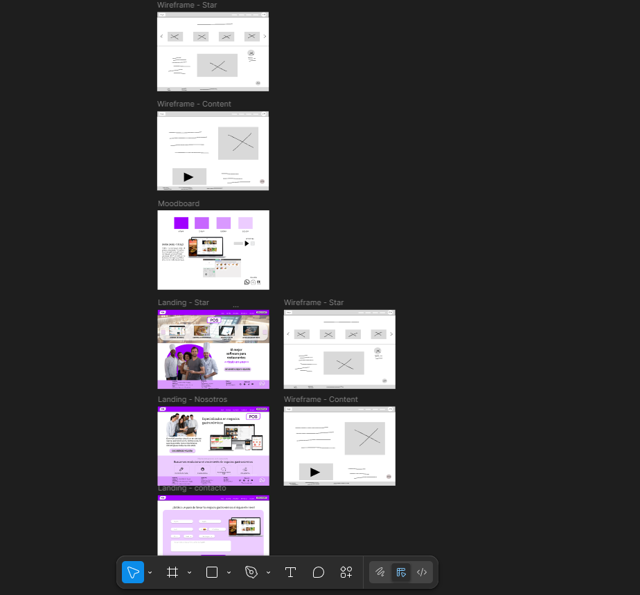

# bit-1
## Pos-para-restaurantes
### EMMA POS

Requerimientos

El rubro gastronómico necesita poder impulsar sus operaciones, controlar la mala praxis generada por el desconocimiento del personal y poder tomar acciones ante situaciones específicas, es por ello que se crea un sistema de gestión operativa, administratíva y logísitica llamado EMMA POS. 

---

Análisis

Buscar la forma de llegar a la mayor cantidad de prospectos, filtrandolos en una página informativa donde pueda incentivarse su decisión de compra y ponerlos en contacto directo con el equipo comercial de Emma POS. 

---

Antecedentes

Emma POS nace basado en la necesidad del rubro gastronómico de controlar, mejorar e impulsar sus operaciones consiguiendo así el crecimiento exponencial necesario. 

---

Buyer persona 

1. Dueño de negocio gastronómico.
2. Administrador de negocios gastronómicos.
3. Gerentes de operaciones de negocio gastronómicos.

---

Autor: Victor Carlucci

